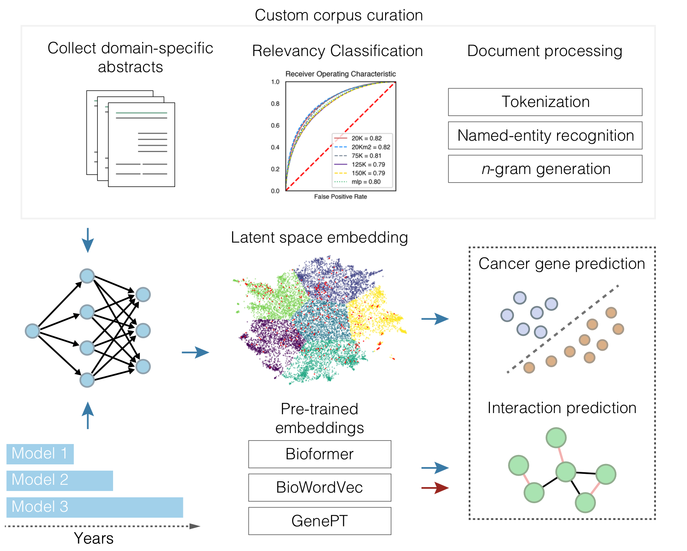
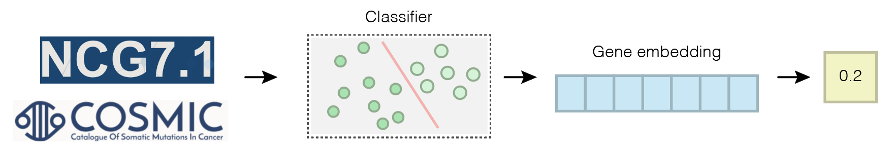
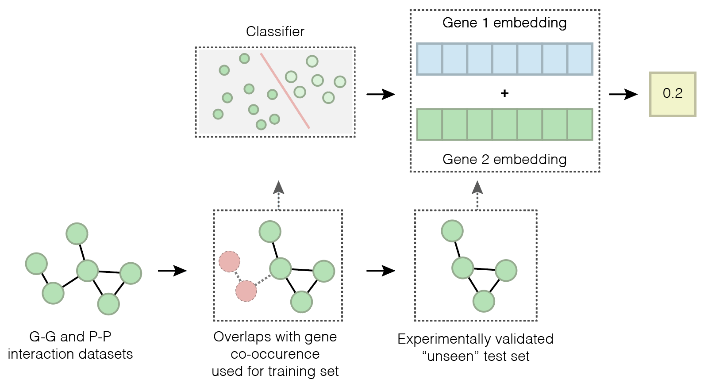

# Genomic NLP

## Custom NLP pipeline for the generation of domain-specific embeddings and their application in downstream machine-learning models
<div align="center">
    
</div>
<br>

## Overview
Genomic NLP is a custom natural language processing pipeline to build dense, gene and disease centric embeddings from millions of scientifc abstracts. Abstracts classified, processed, tagged, and temporally split before training different embedding models. The trained embeddings are further used downstream in classification and interaction prediction tasks.

<br>

## Installation
Genomic NLP is currently available as source code. Install it via:

```sh
$ git clone https://github.com/sciencesteveho/genomic_nlp.git
```

Using a conda environment is highly recommended with `Python == 3.9.19`. Use `pip install -r requirements.txt` to install dependencies.

<br>

## Usage
Genomic NLP is dominantly an analysis project and exists more as a series of modules as opposed to a fully integrated tool. Users are free to utilize aspects of the Genomic NLP pipeline as they choose fit. Modules include:

1. Abstract downloading and text cleaning
2. Abstract relevancy classification, including fine-tuning and grid search
3. Gene and disease entity normalization
4. Standard NLP processing (tokenization, NER, lemmatization)
5. Transformer model fine-tuning
6. Embedding extraction utilities
7. Embedding visualization utilities
8. Cancer gene prediction models
9. Interaction prediction models, including a link prediction GNN

Additionally, all steps of Genomic NLP are "year-aware." That is, abstracts are saved with their "year" metadata intact, allowing the temporal splitting and training of embedding models.

<br>

## Models

We developed models to predict whether a gene is cancerous based only on embedding features. Models include logistic regression, SVM, XGBoost, and MLPs.

<div align="center">
    
</div>

We additionally developed models to predict whether two genes potentially interact based on embedding features. Models include those above along with a GNN.

<div align="center">
    
</div>


Modules are included to prepare data for, build, train, and evaluate all models.
**This repository will be updated and models released when the pre-print is submitted.**

<br>

## Citation
An associated preprint is coming soon.

```bibtex
@misc{Ho/Mills/2025,
  author       = {Ho, Steve and Mills, Ryan E.},
  title        = {Dense Embeddings from Millions of Genomics Abstracts},
  year         = {2025},
  note         = {Pre-release version},
}